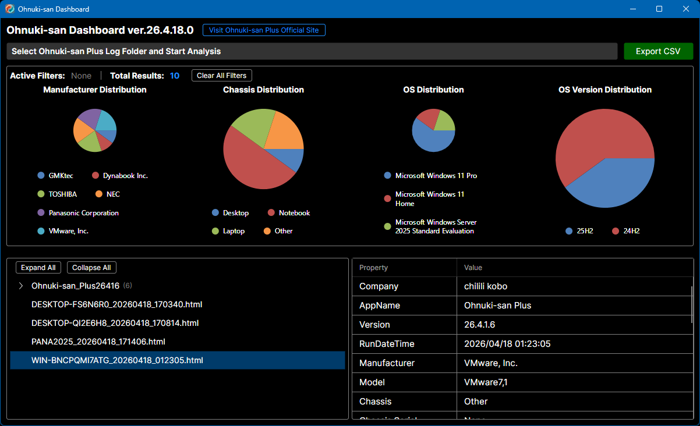

# Ohnuki-san Dashboard

[English](#english) | [日本語](#日本語)

---

## English

**Ohnuki-san Dashboard** is a management tool for visualizing and analyzing PC statistical information from logs generated by "Ohnuki-san Plus".

### 🚀 Key Features
- **Drill-down Analysis**
  Click on graphs to instantly filter your PC list by OS, manufacturer, or chassis type.
- **CSV Export**
  Export summarized PC data (Serial, OS, Model, etc.) for asset management ledgers.
- **Log Management**
  View logs in their original folder structure. Double-click to open the original HTML log.
- **Portable**
  No installation required. Does not use the Windows Registry.

### 📥 Download
Please download the latest version from the Releases page:
👉 **[Download Ohnuki-san Dashboard](https://github.com/chililikobo/OhnukisanDashboard/releases/latest)**

### 💻 System Requirements
- **OS:** Windows 10 / Windows 11
- **Runtime:** Not required (Standalone)
- **Resolution:** 1200x700 or higher recommended

---

## 日本語

**Ohnuki-san Dashboard** は、「Ohnuki-san Plus」で生成された複数のHTMLログを一括読み込みし、PCの統計情報を可視化・分析するための管理ツールです。

### 🚀 主な機能
- **ドリルダウン解析**
  グラフをクリックするだけで、OSやメーカーごとの詳細リストへ即座にフィルタリングできます。
- **CSV出力**
  解析結果をCSV形式で書き出し可能。資産管理台帳の作成を強力にサポートします。
- **ログ管理**
  フォルダ構造を維持したまま、ダブルクリックで元のログ（HTML）をブラウザ表示できます。
- **インストール不要**
  レジストリを使用しないポータブル設計。展開してすぐに使用可能です。

### 📥 ダウンロード
最新のバイナリ（zip形式）は、以下の **Releases** ページから取得してください。
👉 **[Ohnuki-san Dashboard をダウンロード](https://github.com/chililikobo/OhnukisanDashboard/releases/latest)**

### 💻 動作環境
- **OS:** Windows 10 / Windows 11
- **ランタイム:** 不要（スタンドアロン動作）
- **解像度:** 1200x700 以上推奨

---

## 🔗 Links / 関連リンク

- **Official Website (Ohnuki-san Plus):** [Visit Website](https://chililikobo.github.io/en/ohnuki-san-plus.html)
- **Author (X/Twitter):** [@chililikobo](https://x.com/chililikobo)

---

## 📜 License & Disclaimer / ライセンスと免責事項

- **License / ライセンス** 
  Freeware (Commercial use allowed) 
  フリーウェア（商用利用可）

- **Disclaimer / 免責事項** 
  This software is provided "As-Is." The author is not responsible for any damages. 
  本ソフトウェアは現状有姿で提供されます。使用によるデータの損失やPCの不具合等について、作者は一切の責任を負いません。

---
© 2026 chilili kobo
